### Escuela Colombiana de Ingeniería
### Arquiecturas de Software
#### Andrés Jacobo Sepúlveda Sánchez
## Construción de un cliente 'grueso' con un API REST, HTML5, Javascript y CSS3. Parte I.

### Trabajo individual o en parejas. A quienes tuvieron malos resultados en el parcial anterior se les recomienda hacerlo individualmente.

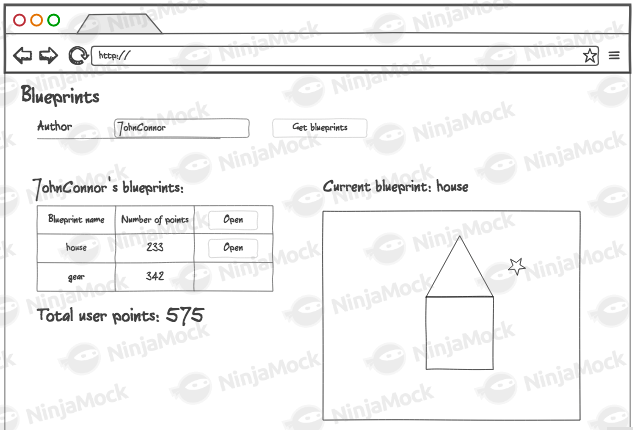

* Al oprimir 'Get blueprints', consulta los planos del usuario dado en el formulario. Por ahora, si la consulta genera un error, sencillamente no se mostrará nada.
* Al hacer una consulta exitosa, se debe mostrar un mensaje que incluya el nombre del autor, y una tabla con: el nombre de cada plano de autor, el número de puntos del mismo, y un botón para abrirlo. Al final, se debe mostrar el total de puntos de todos los planos (suponga, por ejemplo, que la aplicación tienen un modelo de pago que requiere dicha información).
* Al seleccionar uno de los planos, se debe mostrar el dibujo del mismo. Por ahora, el dibujo será simplemente una secuencia de segmentos de recta realizada en el mismo orden en el que vengan los puntos.


## Ajustes Backend

1. Trabaje sobre la base del proyecto anterior (en el que se hizo el API REST).
2. Incluya dentro de las dependencias de Maven los 'webjars' de jQuery y Bootstrap (esto permite tener localmente dichas librerías de JavaScript al momento de construír el proyecto):

    ```xml
    <dependency>
        <groupId>org.webjars</groupId>
        <artifactId>webjars-locator</artifactId>
    </dependency>

    <dependency>
        <groupId>org.webjars</groupId>
        <artifactId>bootstrap</artifactId>
        <version>3.3.7</version>
    </dependency>

    <dependency>
        <groupId>org.webjars</groupId>
        <artifactId>jquery</artifactId>
        <version>3.1.0</version>
    </dependency>                

    ```
	**Agregamos las dependencias y las carpetas con el código dado:**

	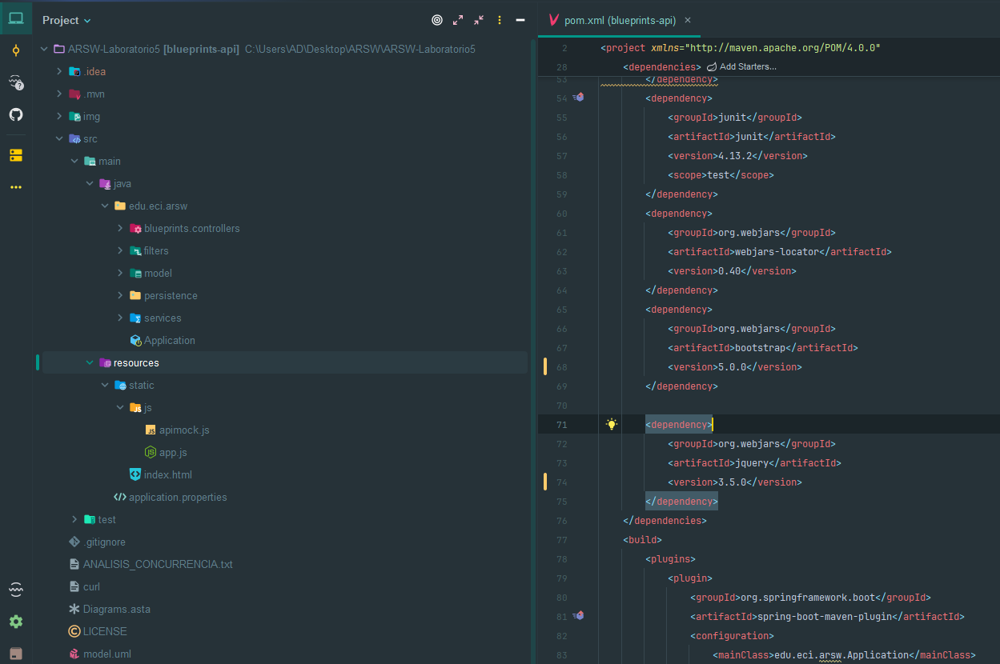

## Front-End - Vistas

1. Cree el directorio donde residirá la aplicación JavaScript. Como se está usando SpringBoot, la ruta para poner en el mismo contenido estático (páginas Web estáticas, aplicaciones HTML5/JS, etc) es:

    ```
    src/main/resources/static
    ```
   
   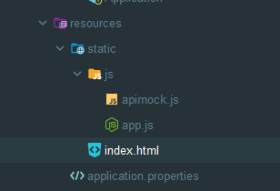

2. Cree, en el directorio anterior, la página index.html, sólo con lo básico: título, campo para la captura del autor, botón de 'Get blueprints', un ```<div>``` donde se mostrará el nombre del autor seleccionado, la tabla HTML donde se mostrará el listado de planos (con sólo los encabezados), y un ```<div>``` donde se mostrará el total de puntos de los planos del autor. Recuerde asociarle identificadores a dichos componentes para facilitar su búsqueda mediante selectores. En el elemento ```<head>``` de la página, agregue las referencia a las librerías de jQuery, Bootstrap y a la hoja de estilos de Bootstrap.
    ```html
    <head>
        <title>Blueprints</title>
        <meta charset="UTF-8">
        <meta name="viewport" content="width=device-width, initial-scale=1.0">

        <script src="/webjars/jquery/jquery.min.js"></script>
        <script src="/webjars/bootstrap/3.3.7/js/bootstrap.min.js"></script>
        <link rel="stylesheet"
          href="/webjars/bootstrap/3.3.7/css/bootstrap.min.css" />
    </head>
    ```
   **```index.html``` solamente con lo básico:**

   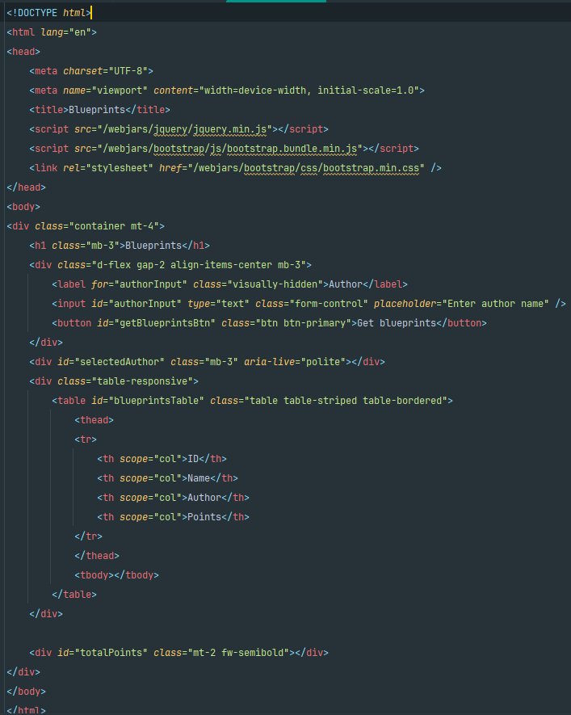
	
4. Suba la aplicación (mvn spring-boot:run), y rectifique:
   
   a. Que la página sea accesible desde:
      ```
      http://localhost:8080/index.html
      ```
   b. Al abrir la consola de desarrollador del navegador, NO deben aparecer mensajes de error 404 (es decir, que las librerías de JavaScript se cargaron correctamente).
   
	**Podemos ver que todo carga correctamente sin lanzar error 404:**

   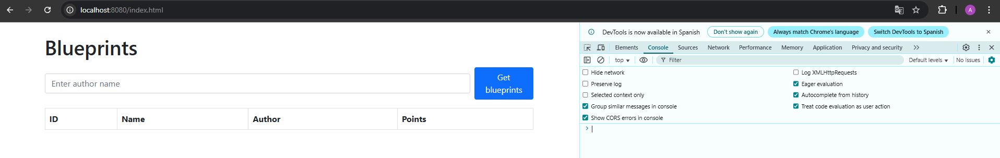
 
## Front-End - Lógica

1. Ahora, va a crear un Módulo JavaScript que, a manera de controlador, mantenga los estados y ofrezca las operaciones requeridas por la vista. Para esto tenga en cuenta el [patrón Módulo de JavaScript](https://toddmotto.com/mastering-the-module-pattern/), y cree un módulo en la ruta static/js/app.js .
   
   **Implementamos la clase ```app.js``` haciendo uso del patrón Módulo, que consume ```apimock.js``` y actualiza la vista:**

   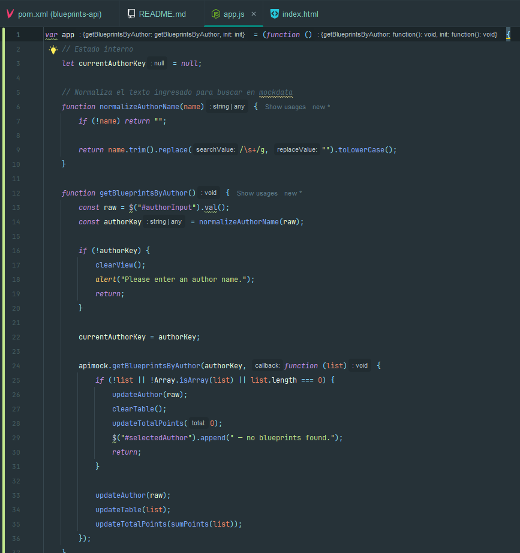

2. Copie el módulo provisto (apimock.js) en la misma ruta del módulo antes creado. En éste agréguele más planos (con más puntos) a los autores 'quemados' en el código.

   **Agregamos más planos para tener más datos de prueba:**
   
   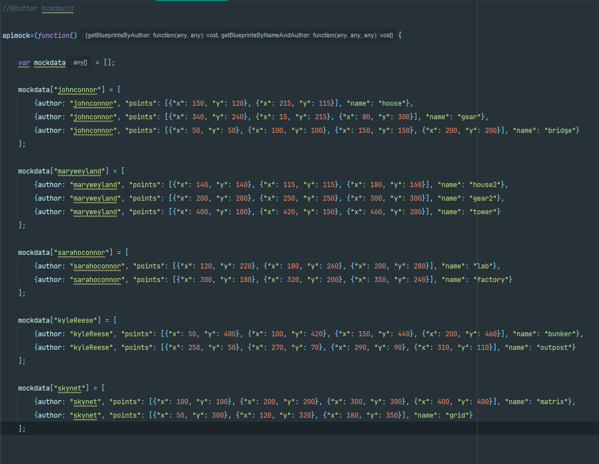
    
3. Agregue la importación de los dos nuevos módulos a la página HTML (después de las importaciones de las librerías de jQuery y Bootstrap):
    ```html
    <script src="js/apimock.js"></script>
    <script src="js/app.js"></script>
    ```
    
   **Ponemos en ```<head>``` las nuevas importaciones:**
   
   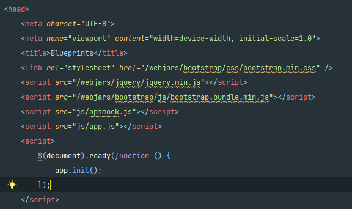
    
4. Haga que el módulo antes creado mantenga de forma privada:
	* El nombre del autor seleccionado.

	* El listado de nombre y tamaño de los planos del autor seleccionado. Es decir, una lista objetos, donde cada objeto tendrá dos propiedades: nombre de plano, y número de puntos del plano.

   Junto con una operación pública que permita cambiar el nombre del autor actualmente seleccionado.
   
   **Añadimos la operación requerida y mantenemos en privado los datos solicitados:**
    
   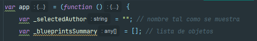

   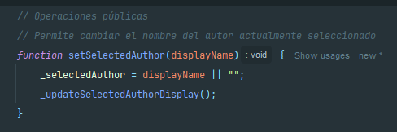

   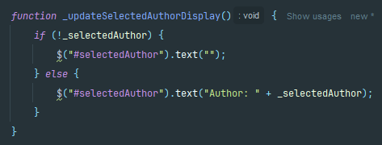 

5. Agregue al módulo 'app.js' una operación pública que permita actualizar el listado de los planos, a partir del nombre de su autor (dado como parámetro). Para hacer esto, dicha operación debe invocar la operación 'getBlueprintsByAuthor' del módulo 'apimock' provisto, enviándole como _callback_ una función que:

	* Tome el listado de los planos, y le aplique una función 'map' que convierta sus elementos a objetos con sólo el nombre y el número de puntos.

      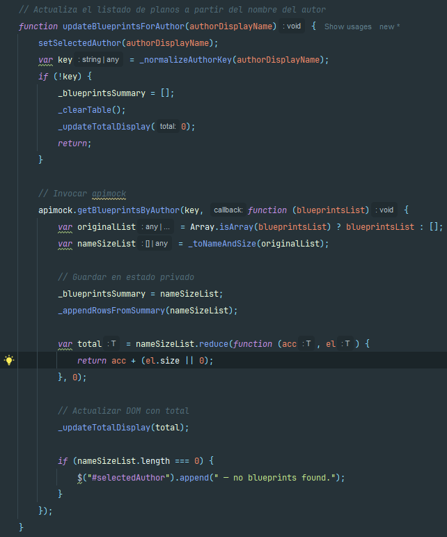

    * Sobre el listado resultante, haga otro 'map', que tome cada uno de estos elementos, y a través de jQuery agregue un elemento \<tr\> (con los respectvos \<td\>) a la tabla creada en el punto 4. Tenga en cuenta los [selectores de jQuery](https://www.w3schools.com/JQuery/jquery_ref_selectors.asp) y [los tutoriales disponibles en línea](https://www.tutorialrepublic.com/codelab.php?topic=faq&file=jquery-append-and-remove-table-row-dynamically). Por ahora no agregue botones a las filas generadas.

      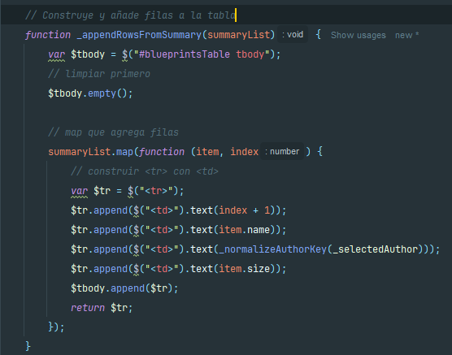

	* Sobre cualquiera de los dos listados (el original, o el transformado mediante 'map'), aplique un 'reduce' que calcule el número de puntos. Con este valor, use jQuery para actualizar el campo correspondiente dentro del DOM.

      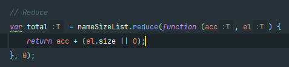
    
6. Asocie la operación antes creada (la de app.js) al evento 'on-click' del botón de consulta de la página.

	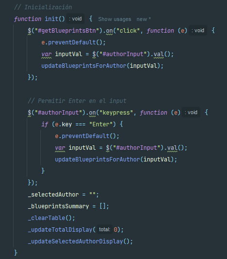 

7. Verifique el funcionamiento de la aplicación. Inicie el servidor, abra la aplicación HTML5/JavaScript, y rectifique que al ingresar un usuario existente, se cargue el listado del mismo.

	**Como se puede observar ahora al buscar a un autor que si exista en ```apimock.js``` saldrá una tabla con los planos del mismo:**
	
	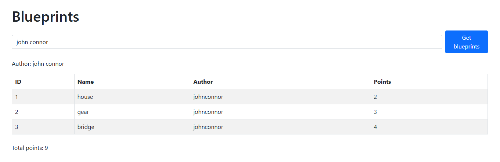

	**Y en el caso de que se coloque un autor que no existe se mostrará la misma tabla pero sin datos:**
	
	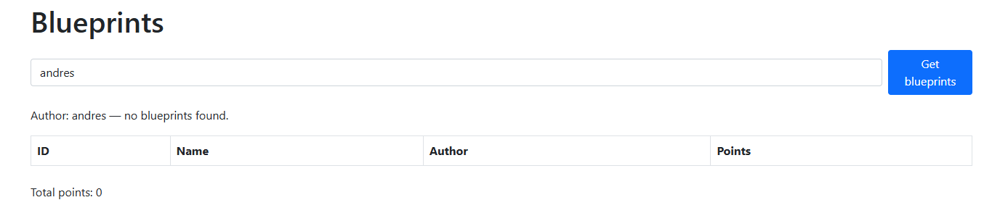 

## Para la próxima semana

8. A la página, agregue un [elemento de tipo Canvas](https://www.w3schools.com/html/html5_canvas.asp), con su respectivo identificador. Haga que sus dimensiones no sean demasiado grandes para dejar espacio para los otros componentes, pero lo suficiente para poder 'dibujar' los planos.

     Se añadió un ``<canvas>`` de tamaño moderado a la página para que sirviera como superficie de dibujo para los planos. Sus dimensiones se eligieron para dejar espacio para los controles y la tabla, a la vez que proporcionaban suficiente espacio para representar con claridad los puntos y los segmentos de conexión. El lienzo usa un ancho máximo del 100%, por lo que se reduce en ventanas gráficas más pequeñas. El ID del lienzo permite al controlador localizar, borrar o redibujar el plano mediante programación.    

    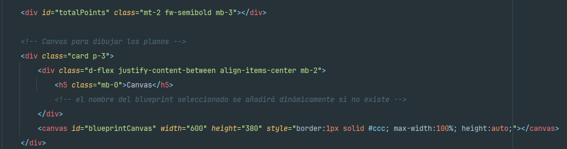

9. Al módulo app.js agregue una operación que, dado el nombre de un autor, y el nombre de uno de sus planos dados como parámetros, haciendo uso del método getBlueprintsByNameAndAuthor de apimock.js y de una función _callback_:
	* Consulte los puntos del plano correspondiente, y con los mismos dibuje consectivamente segmentos de recta, haciendo uso [de los elementos HTML5 (Canvas, 2DContext, etc) disponibles](https://www.w3schools.com/html/tryit.asp?filename=tryhtml5_canvas_tut_path)* Actualice con jQuery el campo <div> donde se muestra el nombre del plano que se está dibujando (si dicho campo no existe, agruéguelo al DOM).

      La operación ``drawBlueprint(author, blueprintName)`` consulta ``apimock.getBlueprintsByNameAndAuthor(...)``, recibe la lista de puntos y dibuja el plano conectando los puntos consecutivamente en el lienzo mediante el contexto 2D (rutas, línea a y pequeños marcadores de punto). Tras obtener los datos, el código también actualiza un elemento DOM que muestra el nombre del plano dibujado (crea el elemento si no existe), lo que proporciona al usuario información inmediata sobre lo que se está renderizando.

      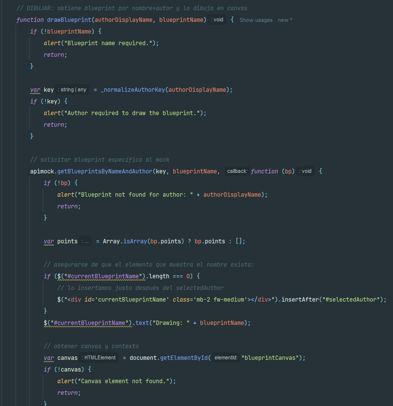

      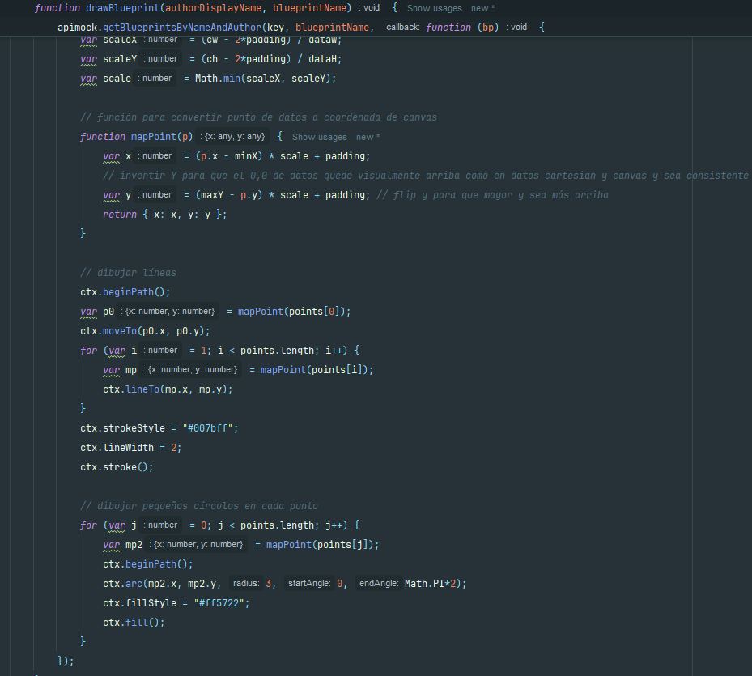

10. Verifique que la aplicación ahora, además de mostrar el listado de los planos de un autor, permita seleccionar uno de éstos y graficarlo. Para esto, haga que en las filas generadas para el punto 5 incluyan en la última columna un botón con su evento de clic asociado a la operación hecha anteriormente (enviándo como parámetro los nombres correspondientes).

    Cada fila de la tabla ahora incluye un botón "Dibujar" conectado a la operación de dibujo con los parámetros de autor y nombre del plano correspondientes. Al hacer clic en el botón, la aplicación resalta y renderiza ese plano específico en el lienzo, para que los usuarios puedan inspeccionar cualquier entrada de la lista sin salir de la página.

    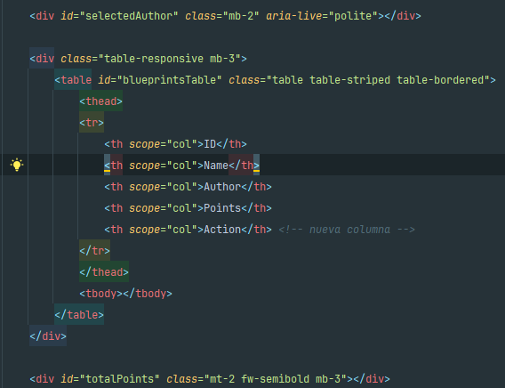    

11. Verifique que la aplicación ahora permita: consultar los planos de un auto y graficar aquel que se seleccione.

    Al integrar todo, la página permite la interacción completa: solicitar los planos de un autor, mostrar la lista (nombre + recuento de puntos) y representar visualmente cualquier plano seleccionado en el lienzo. Todo esto se realiza del lado del cliente y utiliza el archivo ``apimock.js`` proporcionado, lo que permite realizar pruebas de forma rápida y determinista. Además, prueba el flujo de la interfaz de usuario/controlador antes de conectarse a un backend real.

    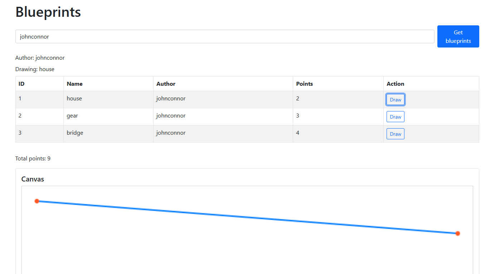

12. Una vez funcione la aplicación (sólo front-end), haga un módulo (llámelo 'apiclient') que tenga las mismas operaciones del 'apimock', pero que para las mismas use datos reales consultados del API REST. Para lo anterior revise [cómo hacer peticiones GET con jQuery](https://api.jquery.com/jquery.get/), y cómo se maneja el esquema de _callbacks_ en este contexto.

    Cree un módulo ``apiclient`` que replica la misma API pública que ``apimock``. Esta realiza solicitudes HTTP GET reales a los puntos finales REST como ``/blueprints/{author}`` y ``/blueprints/{author}/{bpname}``, y luego llama a la devolución de llamada proporcionada con el resultado JSON (o [] / null en caso de error).

    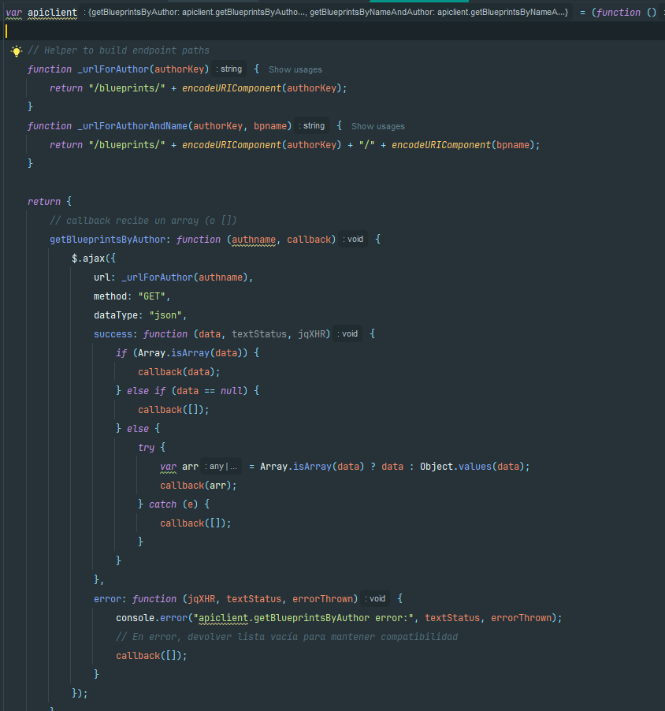

    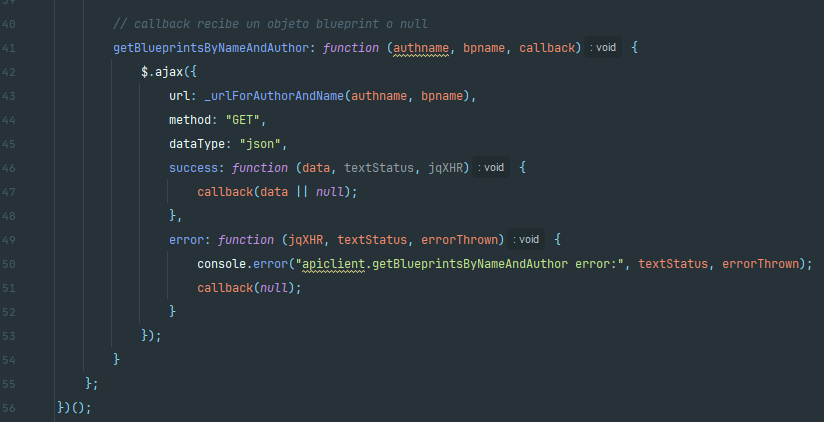

13. Modifique el código de app.js de manera que sea posible cambiar entre el 'apimock' y el 'apiclient' con sólo una línea de código.

    Para facilitar el cambio entre datos de prueba (mock) y datos reales, el controlador de la aplicación se diseñó para depender de una única variable llamada dataSource, en lugar de acoplarse directamente a ``apimock`` o ``apiclient``.  Esta variable dataSource se inicializa para apuntar a la fuente de datos deseada. Por ejemplo, para usar los datos de prueba se utiliza var dataSource = apimock;, mientras que para usar los datos reales de la API, solo es necesario cambiar esa línea a var dataSource = apiclient;    

    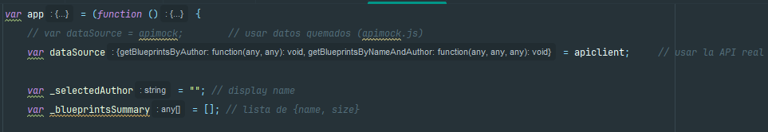